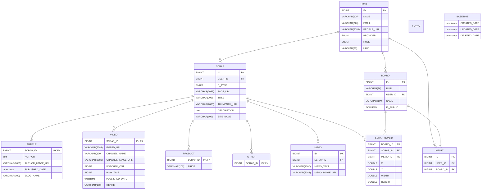

수정일 : 2023-08-04 12:15

# Dadamda Backend

## 📰 프로젝트 소개
모든 사이트의 URL을 담을 수 있고 여러 스크랩들을 모아 사용자가 보드를 꾸미고 공유할 수 있는 웹 서비스입니다.

## 🐳 개발 환경
- Java 11 `Amazon Corretto version 11.0.20`
- Spring Boot `2.7.13`
- Gradle `7.6.1`
- JPA `3.1.2`
- AWS RDS `MySQL 8.0.32`
- GitHub Actions

## 🖥️ 관리 도구
- 형상 관리 : Github
- 이슈 관리 : Jira
- 커뮤니케이션 : Confluence
- 디자인 : Figma

# 📂 ERD

